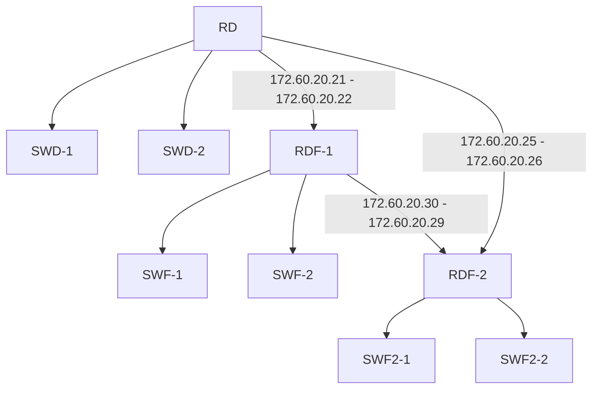

# WAN-static-route
Complete configuration of enterprise network with 9 Cisco devices including
# 🚀 Cisco Enterprise Network - Technical Documentation


## 📌 Project Overview
Complete configuration of enterprise network with 11 Cisco devices including:
- 3 Cisco 2901 routers
- 6 Catalyst 2960 switches
- user swithces/routers : admin
- Password swithces/routers : P@ssw0rd
## 🏷 Device Specifications (Updated)

### Routers
| Name | Model | IP Address | Role |
|------|-------|------------|------|
| RD | 2901 | 172.60.20.21 | Site A Router |
| RDF-1 | 2901 | 172.60.20.22 | Site B Router |
| RDF-2 | 2901 | 172.60.20.26 | Site C Router |

### Switches (Complete)
| Name | Model | IP Address | Location | Key Features |
|------|-------|------------|----------|--------------|
| SWD-1 | 2960 | 192.168.200.2 | Site A | - | 
| SWD-2 | 2960 | 192.168.200.6 | Site A | - |
| SWF-1 | 2960 | 192.168.200.6 | Site B | - |
| SWF-2 | 2960 | 192.168.200.2 | Site B | - |
| SWF2-1 | 2960 | 192.168.200.2 | Site C | - |
| SWF2-2 | 2960 | 192.168.200.6 | Site C | - |

## 🔷 VLAN Architecture 
### VLAN Allocation Table
| VLAN ID | Name        | Purpose          | Associated Devices |
|---------|-------------|------------------|--------------------|
| 1       | Default     | Unused           | All switches       |
| 20      | Computers   | User workstations| All switches       |
| 25      | Servers     | Server           | All switches       |
| 200     | Management  | Device management| All devices        |
## 🔐 Access Control Lists (ACLs) - Detailed Implementation

### 📌 Standard ACLs (Layer 3 Control)
**1. Management Access Control:**
```cisco
 Restrict SSH/VTY access to management station
access-list 1 permit host 192.168.200.5
access-list 1 permit host 192.168.200.1
access-list 1 deny any log

line vty 0 2
access-class 1 in
```
## 🌐 Network Topology (Complete Version)


